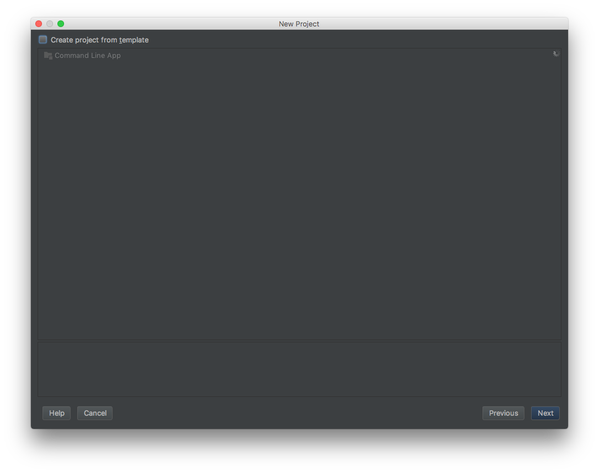
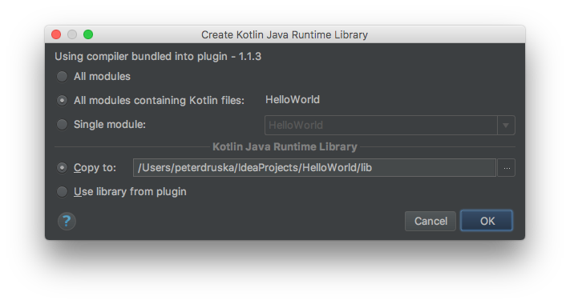
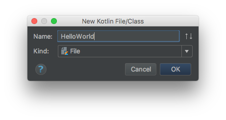
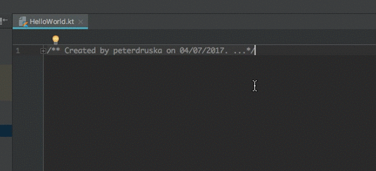

## Úvod do jazyka Kotlin

[Jazyk Kotlin](https://kotlinlang.org) je pomerne mladý jazyk, ktorý vznikol na základe jazyka Java, aby sa dali medzi sebou ľahko nahrádzať. Hovoríme aj, aby boli navzájom kompatibilné.

Je to moderný programovací jazyk, ktorý je

- Jednotný (konzistentný) – je vždy jasné, čo je zapísané
- Bezpečný – pri práci sa robí menej chýb, ako pri práci s Javou
- Medzioperačný – dá sa používať všade tam, kde Java: server, Android, …
– Dá sa programovať v rôznych nástrojoch

### Vývojové prostredie

Na základnú prácu a spoznanie sa s jazykom Kotlin budeme používať softvér, ktorý je zadarmo a volá sa [IntelliJ IDEA](https://www.jetbrains.com/idea/). Ten si treba stiahnuť a otvoriť, aby sme mohli začať.

### Vytvorenie nového projektu v IntelliJ IDEA

V IntelliJ IDEA potrebujeme po spustení urobiť pár základných úkonov, aby sme mohli napísať prvý program v jazyku Kotlin.

[](kotlin/images/NewProject.png)

1. Ako **Project SDK** vybrať konkrétnu verziu Javy, ktorá by v IntelliJ IDEA mala byť už doinštalovaná.
2. V časti **Additional Libraries and Frameworks** zaškrtnúť voľbu **Kotlin (Java)**
3. **Use Library** by malo obsahovať *KotlinJavaRuntime*
4. **Next**

Ďalším krokom je výber šablóny. Tento krok teraz preskakujeme, vôbec nás nezaujíma, nakoľko začneme s jazykom Kotlin *na čistom papieri*, ako sa hovorí.

[](kotlin/images/Template.png)

Zadáme **Next**.

[](kotlin/images/Name.png)

V ďalšom kroku zadáme meno nového projektu. V ukážke to je **Hello World** a zadáme **Finish**.

### Nastavenie projektu

Teraz sa otvorí obrazovka projektu *Hello World*.

[](kotlin/images/Project.png)

Teraz je dôležité nastaviť jazyk Kotlin v projekte pomocou **Tools > Kotlin > Configure Kotlin in Project > All modules containing Kotlin files**. Zvyšok ponecháme tak, ako je a potvrdíme **OK**.

[](kotlin/images/ConfigureKotlin.png)

### Štruktúra projektu

Zatiaľ nás bude zaujímať zo štruktúry projektu zložka `/src/`.

[](kotlin/images/Src.png)

Vyznačíme ju a klikneme pravým tlačidlom. Po zobrazení ponuky vyberieme `New > Kotlin File/Class`.

[](kotlin/images/KotlinFile.png)

Potom zadáme meno nového súboru, napr. **HelloWorld** a potvrdíme **OK**.

[](kotlin/images/FileName.png)

IntelliJ IDEA teraz pripraví a otvorí nový súbor na úpravu.

[](kotlin/images/EditFile.png)

## Prvý program

V otvorenom súbore **HelloWorld.kt** napíšeme `main` a stlačíme tabulátor.



IntelliJ IDEA automaticky doplní hlavnú funkciu, do ktorej budeme písať akýkoľvek program v začiatkoch. Nebudeme sa teraz zaoberať, čo je funkcia, prečo sa táto volá `main`, ani čo je to tam popísané. Momentálne nám pôjde o to, čo bude v zložených zátvorkách `{}`.


Aby sme ten prvý program skúsili, do spomínaných zložených zátvoriek napíšeme tento príkaz:

```
println("Toto je môj prvý program v jazyku Kotlin!")
```
